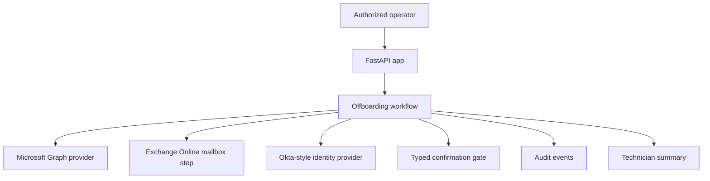

# Cross-Tenant Offboarding

This is a clean-room public implementation inspired by common enterprise automation patterns. It does not contain proprietary code, production data, credentials, or confidential business logic from any employer or client.

Cross-Tenant Offboarding is a FastAPI workflow application for discovering, reviewing, confirming, and executing user offboarding actions across Microsoft Graph-managed tenants, Exchange Online mailbox state, and Okta-style SaaS identity providers. The public version preserves the production workflow shape while replacing organization-specific tenants, domains, users, ticket numbers, approval groups, and deployment values with redacted placeholders.

## Current Status

- Primary app entrypoint: `src/cross_tenant_offboarding/app.py`
- Runtime: Python, FastAPI, Pydantic
- Workflow model: discover, review, typed confirmation, execute, audit
- Providers represented: Microsoft Graph, Exchange Online, Okta-style SaaS identity
- Execution model: dry-run capable action records
- Audit model: append-only event list in the public implementation

## What This App Does

The workflow standardizes identity offboarding steps that are risky when performed manually:

- discover the subject across configured providers
- return account, group, and license context
- require exact typed confirmation before execution
- model sign-in disablement and session revocation
- preserve or convert Exchange Online mailbox state before license removal
- remove group memberships and license assignments
- suspend SaaS identity accounts and clear sessions
- produce technician-readable execution summaries
- record audit events for discovery, failed confirmation, and execution

## Architecture



## Important Files

| Path | Purpose |
|---|---|
| `src/cross_tenant_offboarding/app.py` | FastAPI routes |
| `src/cross_tenant_offboarding/workflow.py` | Discovery, confirmation, execution, and audit orchestration |
| `src/cross_tenant_offboarding/providers.py` | Redacted provider implementations for Graph/EXO/Okta-style actions |
| `src/cross_tenant_offboarding/models.py` | Account, action, report, and audit models |
| `docs/workflow-controls.md` | Operational control design |
| `.env.example` | Placeholder configuration |
| `tests/test_offboarding.py` | Discovery, confirmation, and dry-run safety tests |

## Workflow Details

| Phase | Production behavior represented |
|---|---|
| Discovery | Query Microsoft Graph and SaaS identity providers for matching subject accounts |
| Review | Show enabled state, group memberships, license assignments, and tenant/source context |
| Confirmation | Require exact `OFFBOARD <subject>` typed confirmation |
| Mailbox preservation | Convert or preserve Exchange Online mailbox state before license cleanup |
| Access cleanup | Disable sign-in, revoke sessions, remove groups, remove licenses, suspend SaaS identities |
| Audit | Record actor, subject, event type, timestamp, and summary detail |

## Route Map

| Route | Method | Purpose |
|---|---|---|
| `/subjects/{subject}/discover` | GET | Discover accounts across providers |
| `/offboarding/execute` | POST | Execute confirmed offboarding workflow |
| `/audit` | GET | View audit events |

## Configuration

| Setting | Purpose |
|---|---|
| `DRY_RUN_DEFAULT` | Default execution mode |
| `GRAPH_AUTH_REFERENCE` | Secret reference for Microsoft Graph credentials |
| `EXCHANGE_ONLINE_AUTH_REFERENCE` | Secret reference for Exchange Online credentials |
| `OKTA_AUTH_REFERENCE` | Secret reference for SaaS identity credentials |
| `SERVICENOW_AUTH_REFERENCE` | Secret reference for ticket update credentials |

## Local Development

```powershell
python -m venv .venv
.\.venv\Scripts\Activate.ps1
pip install -r requirements.txt
pytest
uvicorn cross_tenant_offboarding.app:app --reload --port 8040
```

## Redaction Boundary

This repository preserves the workflow design, provider boundaries, action ordering, and safety gates. It omits or replaces real tenant/customer names, domains, app IDs, ticket numbers, approval identities, mailbox addresses, URLs, logs, and credentials.
