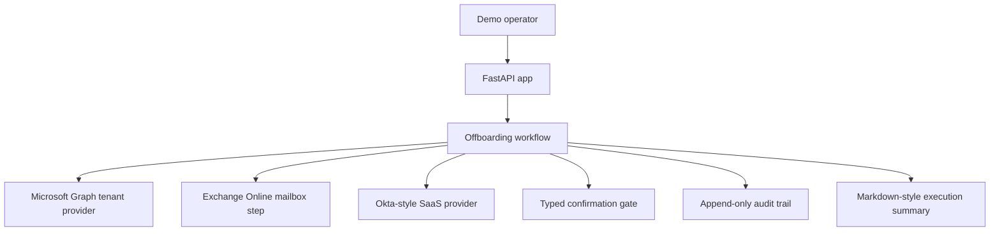

# Cross-Tenant Offboarding

This is a clean-room educational/demo implementation inspired by common enterprise automation patterns. It does not contain proprietary code, data, credentials, or confidential business logic from any employer or client.

Cross-Tenant Offboarding demonstrates a safety-first identity lifecycle workflow across synthetic tenants. It uses Microsoft Graph-style, Exchange Online-style, and SaaS identity mock providers to model discovery, review, confirmation, dry-run execution, mailbox handling, license removal, and audit evidence without contacting real directories, ticketing systems, mail systems, or customer environments.

## Architecture



## Demo Workflow

1. Discover a user across configured mock tenants.
2. Review account status, group memberships, and license labels.
3. Require exact typed confirmation before execution.
4. Execute in dry-run mode by default.
5. Model Exchange Online mailbox conversion and forwarding as explicit dry-run actions.
6. Record an audit event for discovery, confirmation failures, and execution.
7. Return a technician-readable summary of planned actions.

## Safety Controls

- No live API clients are included.
- No production identifiers are included.
- No real users, domains, tickets, groups, devices, or logs are included.
- Execution defaults to dry run.
- Confirmation must exactly match `OFFBOARD <subject>`.

## Quick Start

```powershell
python -m venv .venv
.\.venv\Scripts\Activate.ps1
pip install -r requirements.txt
pytest
uvicorn cross_tenant_offboarding.app:app --reload --port 8040
```

Open the local API docs path shown by the dev server.

## Demo Endpoints

| Route | Purpose |
|---|---|
| `GET /subjects/{subject}/discover` | Discover mock accounts |
| `POST /offboarding/execute` | Run confirmed dry-run offboarding |
| `GET /audit` | View audit events |

## Integration Shape

| System | Production-style action represented | Demo action |
|---|---|---|
| Microsoft Graph | Disable user, revoke sign-in sessions, remove group memberships, remove license assignments | Synthetic `ActionRecord` entries |
| Exchange Online | Convert mailbox to shared, set forwarding, preserve mailbox before license removal | Dry-run mailbox action records |
| Okta or SaaS identity provider | Suspend user, clear sessions, remove application groups | Synthetic provider action records |
| ServiceNow | Attach technician summary to an incident work note | Technician summary string only |
